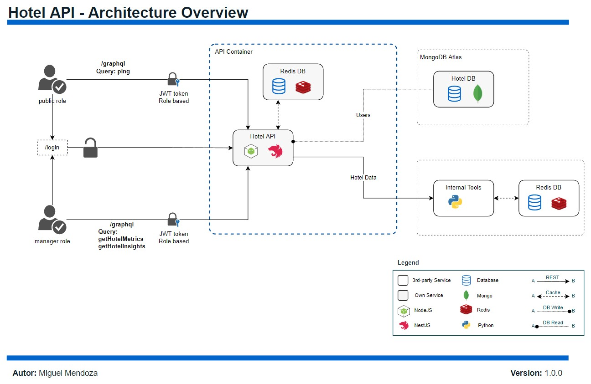

# Hotel API _(hotel-api)_
## Hotels insights and metrics
 provide a clear way to let the Hotel managers see whats the price in other competitors in order to provide them with tools that can be helpful while assigning prices to their rooms in their self-hosted website

## Table of Contents
- [Architecture](#architecture)
- [Install](#install)
  - [Requirements](#requirements)
  - [Installation](#installation)
  - [Env](#env)
- [Usage](#usage)
- [Cloud](#cloud)
  - [Docker](#docker)
- [Test and Coverage](#test-and-coverage)
  - [Lint](#lint)
- [Related links](#related-links)

## Architecture

## Install
### Requirements
```
NodeJS v16
NestJS Framework
Typescript
Redis DB

External API -> Backend Internal Tools
```
### Installation
```
// Install framework and dependencies
npm install
// or
yarn install
```
### Env
To start correctly, project need following env variables in `.env` file located in root folder
```
DB_URL=
EXTERNAL_API=
```
## Usage
```
// Init project in development mode, with auto-refresh
npm run start:dev
```
When compile finished, open your browser on http://localhost:3000/graphql

## Cloud
### Docker
```
// Deploy containers
docker-compose -d
```
## Test and coverage
This project use Jest and supertest for perfom testing task
```
// run test suites
npm test

// run coverage verification
npm run test:coverage

// run end-to-end test
npm run test:e2e
```
### Lint
```
// check code standars
npm run lint
```

## Related Links
- [NestJS](https://docs.nestjs.com/)
- [GraphQL](https://graphql.org/)
