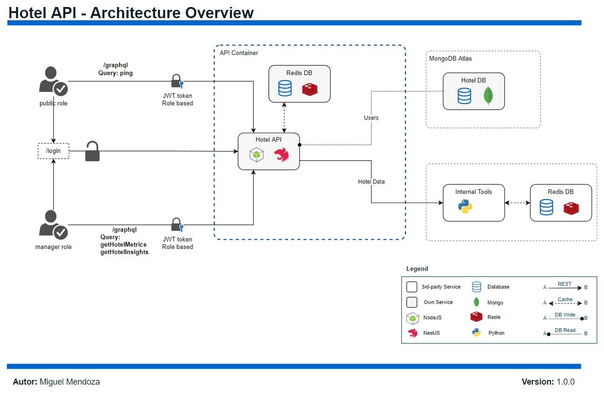

# Hotel API _(hotel-api)_
## Hotels insights and metrics
 provide a clear way to let the Hotel managers see whats the price in other competitors in order to provide them with tools that can be helpful while assigning prices to their rooms in their self-hosted website

## Table of Contents
- [Architecture](#architecture)
- [Install](#install)
  - [Requirements](#requirements)
  - [Installation](#installation)
  - [Env](#env)
- [Usage](#usage)
- [Cloud](#cloud)
  - [Docker](#docker)
- [Test and Coverage](#test-and-coverage)
  - [Lint](#lint)
- [Related links](#related-links)

## Architecture


## Tech Stack
- **Framework**: NestJS 11.1+ with TypeScript 6+
- **GraphQL**: Apollo Server 5 + @nestjs/graphql 13
- **Database**: MongoDB with Mongoose 11
- **Cache**: @nestjs/cache-manager with Redis adapter
- **Auth**: JWT + Passport strategies
- **Testing**: Jest 30+ with comprehensive test coverage
- **Linting**: ESLint 10 (flat config) + Prettier 3

## Install
### Requirements
```
Node.js v20+
Docker & Docker Compose
Redis (for caching)
MongoDB (for data persistence)
```

### Installation
```bash
# Install dependencies
npm install

# Create .env file from example
cp .env.example .env

# Update .env with your configuration
# Required: JWT_SECRET, DB_URL, EXTERNAL_API
```

### Environment Variables
See [.env.example](.env.example) for all available options:
- `JWT_SECRET`: Secret key for JWT signing (required for production)
- `DB_URL`: MongoDB connection string
- `EXTERNAL_API`: External API endpoint for competitor data
- `REDIS_HOST`, `REDIS_PORT`: Redis configuration

## Usage

### Development
```bash
# Start development server with hot reload
npm run start:dev

# Open GraphQL Playground
# Navigate to http://localhost:3000/graphql
```

### Production Build
```bash
# Build project
npm run build

# Start production server
npm start
```

## Docker Deployment

### Quick Start with Docker Compose
```bash
# Start all services (API, MongoDB, Redis)
docker compose up -d

# View logs
docker compose logs -f hotel_api

# Stop services
docker compose down
```

**Services included:**
- `hotel_api`: NestJS application (port 3000)
- `mongodb`: MongoDB database (port 27017)
- `redis`: Redis cache (port 6379)

### Build Custom Docker Image
```bash
# Build image
docker build -t hotel-api:latest .

# Run container
docker run -p 3000:3000 \
  -e JWT_SECRET=your-secret-key \
  -e DB_URL=mongodb://mongodb:27017/hotel_db \
  -e EXTERNAL_API=http://api.example.com/hotels/ \
  hotel-api:latest
```

## Development

### Code Quality
```bash
# Run linting
npm run lint

# Fix linting issues automatically
npm run lint -- --fix

# Format code with Prettier
npx prettier --write "src/**/*.ts"
```

### Testing
```bash
# Run all tests
npm test

# Run tests in watch mode
npm test -- --watch

# Generate coverage report
npm run test:cov

# Run end-to-end tests
npm run test:e2e
```

### Test Coverage
This project includes comprehensive test suites for:
- **Auth Guard**: JWT validation and role-based access control
- **Services**: Metrics, insights, and health check logic
- **Resolvers**: GraphQL query endpoints with caching
- **Total**: 16+ tests across 8 test suites

Current test results: ✓ All tests passing

## Code Architecture & Conventions

### NestJS Conventions Applied
- **Module Organization**: Feature-based modules (auth, metrics, insights, health)
- **Dependency Injection**: Constructor-based DI throughout
- **DTOs with Validation**: Class-validator decorators on all input DTOs
- **GraphQL First**: All data models as GraphQL ObjectTypes
- **Caching**: Resolver-level caching with @nestjs/cache-manager
- **Error Handling**: Exception filters for consistent error responses
- **Type Safety**: Full TypeScript strict mode support

### TypeScript Best Practices
- **Explicit Types**: All method parameters and return types annotated
- **Interfaces**: Service contracts with `I` prefix (e.g., `IAuthService`)
- **Generics**: Used in cache manager and service responses
- **Safe Access**: Optional chaining and nullish coalescing operators
- **Constants**: Centralized error messages and status codes

### Folder Structure
```
src/
├── auth/              # Authentication & JWT
│   ├── interfaces/    # Auth-specific interfaces
│   ├── schemas/       # Mongoose schemas
│   └── test/          # Auth tests
├── metrics/           # Hotel metrics & pricing
│   ├── dto/           # Input validation DTOs
│   ├── interfaces/    # Type definitions
│   ├── models/        # GraphQL ObjectTypes
│   └── test/          # Metrics tests
├── insights/          # Competitor insights
│   ├── dto/           # Input validation
│   ├── interfaces/    # Type definitions
│   ├── models/        # GraphQL ObjectTypes
│   └── test/          # Insights tests
├── health/            # Health checks
│   ├── models/        # Health status types
│   └── test/          # Health tests
└── common/            # Shared utilities
    ├── constants.ts   # HTTP codes & messages
    ├── period.enum.ts # Time period enumeration
    └── roomType.enum.ts # Room type enumeration
```

### Security
- **JWT Secrets**: Environment variable driven
- **Input Validation**: ValidationPipe with whitelist mode
- **CORS**: Configured for safe cross-origin requests
- **Database**: Mongoose with schema validation
- **Docker**: Non-root user execution

## Related Links
- [NestJS Documentation](https://docs.nestjs.com/)
- [GraphQL Official](https://graphql.org/)
- [Apollo Server](https://www.apollographql.com/docs/apollo-server/)
